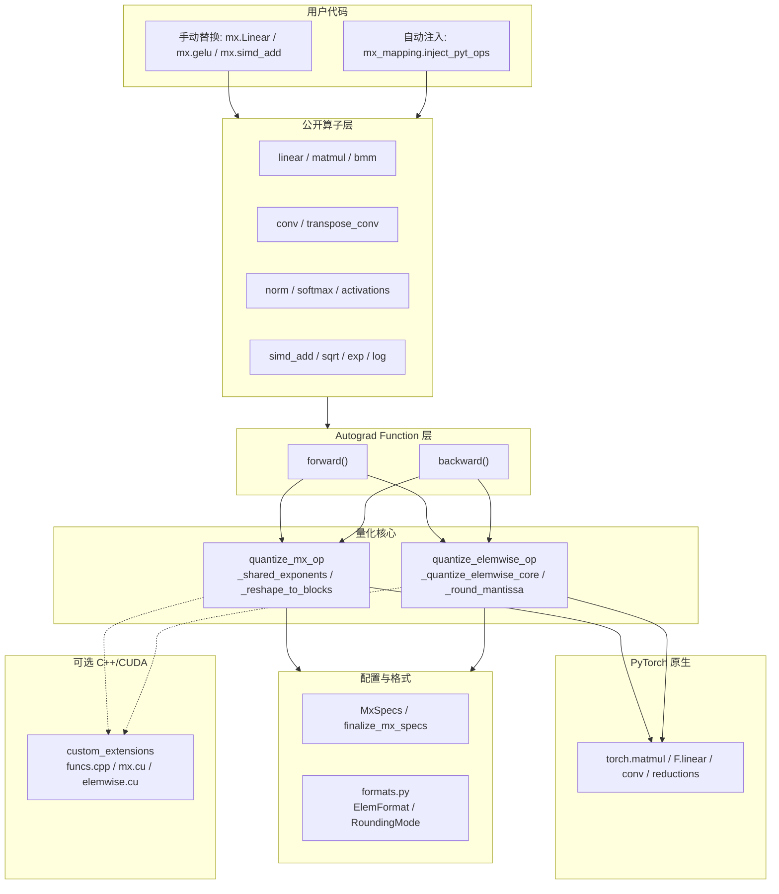

# microxcaling 项目架构文档

> 本文档基于 GitNexus 知识图谱自动生成。  
> 索引规模：86 个文件、1,861 个符号、3,600 条关系、30 个功能分区、161 条执行流。

## 1. 项目概述

`microxcaling` 是微软开源的面向 PyTorch 的 **Microscaling (MX) 数据格式仿真库**。它的核心目标不是提供新的张量执行后端，而是在 PyTorch 的 float32 / bfloat16 / fp16 计算之上，将数值限制到 OCP MX 格式或自定义 bfloat/fp 格式可表示的范围内，从而支持深度学习模型在不同低精度格式下的数值探索。

项目提供两类核心能力：

- **MX 量化矩阵类算子**：`linear`、`matmul`、`bmm`、卷积、转置卷积等，重点处理共享指数（Shared Exponent）、块大小（Block Size）、权重/激活/反向传播格式。
- **Elementwise / Vector 低精度仿真**：激活函数、softmax、norm、SIMD 风格加减乘除、归约、sqrt、exp、log 等，重点通过 bfloat 或 fp 格式对中间结果进行量化。

**构建与依赖**
- 包名：`mx`
- 构建后端：`hatchling` + `hatch-vcs`
- 核心依赖：`torch==2.2.0`、`torchvision==0.17`、`torchaudio==2.2.0`
- C++/CUDA 扩展在导入时通过 `torch.utils.cpp_extension.load` JIT 编译（见 `mx/custom_extensions.py`），安装阶段不预编译。

## 2. 功能分区（Knowledge Graph Communities）

知识图谱将代码库划分为 4 个高内聚的功能社区：

| 分区 | 符号数 | 内聚度 | 说明 |
|------|--------|--------|------|
| **Mx** | 162 | ~0.96 | 核心 Python 库：算子、Autograd Function、量化逻辑、格式工具。 |
| **Tests** | 90 | ~0.59 | 单元测试与回归测试，覆盖格式、elementwise/MX 量化、矩阵算子、Norm、激活、梯度检查。 |
| **Cuda_demo** | 27 | ~0.93 | 独立 C++ MX 量化演示（`cuda_demo/mx_demo_complete.cpp`）及 `mx/cpp/funcs.cpp` 的 pybind 桥接。 |
| **Cpp** | 10 | 1.0 | C++/CUDA 扩展头文件与 Kernel：`funcs.h`、`funcs.cpp`、`elemwise.cu`、`mx.cu`、`reduce.cu`。 |

### 目录结构

```
microxcaling/
├── mx/                           # Python 包主体
│   ├── specs.py                  # MX 配置对象、默认值、argparse 接入、配置归一化
│   ├── formats.py                # 格式枚举、舍入枚举、格式参数计算
│   ├── mx_ops.py                 # MX 共享指数 / 分块 / 核心 MX 量化
│   ├── elemwise_ops.py           # bfloat/fp/int 风格 elementwise 量化
│   ├── vector_ops.py             # 非 autograd 的向量基础操作
│   ├── simd_ops.py               # 带 autograd 的 SIMD 风格操作
│   ├── linear.py / matmul.py / bmm.py
│   ├── convolution.py / transpose_convolution.py
│   ├── activations.py / softmax.py
│   ├── layernorm.py / groupnorm.py / batchnorm.py / norm_utils.py
│   ├── rnn.py
│   ├── mx_mapping.py             # PyTorch 自动注入映射
│   ├── custom_extensions.py      # 编译并加载 C++/CUDA 扩展
│   ├── cpp/                      # C++/CUDA 自定义量化与归约 kernel
│   └── tests/                    # 单元测试
├── examples/                     # 手动接入与自动注入示例
├── cuda_demo/                    # 独立 C++ MX 演示
├── pyproject.toml
└── README.md / README_CN.md
```

## 3. 架构分层



### 3.1 配置层

核心文件：`mx/specs.py`

`MxSpecs` 继承自 `collections.UserDict`，集中定义所有量化选项：
- MX 格式：`scale_bits`、`w_elem_format`、`a_elem_format`、反向传播相关格式、`block_size`、`shared_exp_method`。
- Elementwise 格式：`bfloat`、`fp`、`bfloat_subnorms`。
- 训练控制：`quantize_backprop`。
- 舍入控制：全局 `round` 以及 output、weight、grad、MX forward/backward 各路径的细分舍入配置。
- 执行后端：`custom_cuda`。

配置标准化由 `finalize_mx_specs` 完成：未显式设置的反向传播格式继承自前向格式，多个细分舍入选项继承自全局舍入选项，并通过 `apply_mx_specs` 补齐默认值。如果完全未开启量化配置，默认提前返回 `None`，让上层算子直接走 PyTorch 原生路径。

### 3.2 格式与数值工具层

`mx/formats.py` 定义 `RoundingMode`、`ElemFormat` 以及格式参数计算函数。`mx/elemwise_ops.py` 和 `mx/mx_ops.py` 都依赖这里的格式元数据来得到 exponent bits、mantissa bits、最大正规数等信息。

这层的职责是把字符串配置如 `fp8_e4m3`、`fp6_e3m2`、`fp4_e2m1`、`int8` 映射到可执行的数值约束。

### 3.3 MX 量化核心

核心文件：`mx/mx_ops.py`

关键函数：
- `_shared_exponents`：按指定轴计算共享指数，常用策略是对绝对值取 max 后 `floor(log2(...))`。
- `_reshape_to_blocks` / `_undo_reshape_to_blocks`：把输入张量按 block size 切成 MX 分块，完成 padding、view 和恢复。
- `_quantize_mx`：执行完整 MX 量化。流程是选择共享指数、处理 block、按 shared exponent 缩放、调用 elementwise core 量化尾数，再缩放回原尺度。
- `quantize_mx_op`：面向上层 autograd 算子的公开入口，负责从 `mx_specs` 取 `scale_bits`、`block_size`、`shared_exp_method`、`custom_cuda` 等配置。

知识图谱显示 `quantize_mx_op` 是矩阵类算子的中心依赖，被 `linear`、`matmul`、`bmm`、`convolution`、`transpose_convolution` 的 forward 和 backward 路径共同调用。

### 3.4 Elementwise 量化核心

核心文件：`mx/elemwise_ops.py`

关键函数：
- `_round_mantissa`：实现 `dither`、`floor`、`nearest`、`even` 等舍入模式。
- `_quantize_elemwise_core`：对输入张量执行 mantissa 截断、denorm 控制、Inf/NaN 处理和范围饱和/溢出。
- `_quantize_bfloat`：把张量限制到 bfloatX 格式。
- `_quantize_fp`：把张量限制到固定 5 exponent bits 的 fpX 格式。
- `quantize_elemwise_op`：上层公开入口，按 `mx_specs["bfloat"]` 或 `mx_specs["fp"]` 选择具体量化方式。

`mx/vector_ops.py` 是基于 `quantize_elemwise_op` 的非 autograd 向量操作层；`mx/simd_ops.py` 则为加减乘除、sqrt、exp、log、sum、mean、norm 等操作提供 autograd 封装。

### 3.5 算子封装层

矩阵类算子通常采用相同模式：
1. 入口函数或 Module 检查 `mx_specs`。
2. 如果 `mx_specs is None`，直接调用 PyTorch 原生算子。
3. 否则通过 `apply_mx_specs` 补齐配置。
4. 使用自定义 `torch.autograd.Function` 控制 forward 和 backward。
5. forward 中先做 elementwise 量化，再做 MX 量化，然后调用 PyTorch 原生计算。
6. backward 中根据 `get_backwards_mx_specs` 决定是否量化反向传播，并对 grad input / grad weight / grad output 使用不同格式和舍入策略。

代表模块：
- `mx/linear.py`：`LinearFunction`、`linear`、`Linear`。前向对 input 和 weight 分别使用 activation/weight MX 格式；反向分别计算 `grad_weight`、`grad_input`、`grad_bias`。
- `mx/matmul.py`：`MatMulFunction`、`matmul`。支持 `mode_config` 为 `aa`、`aw`、`wa`，用于区分 activation/weight 组合。
- `mx/bmm.py`：`BMMFunction`、`bmm`。支持多 outer dims 的 batch matmul。
- `mx/convolution.py`、`mx/transpose_convolution.py`：把卷积权重和输入以类似矩阵乘路径量化。

norm、activation、softmax 等模块更多依赖 `vector_ops` / `simd_ops` / `norm_utils` 的 elementwise 量化路径，用低精度向量操作模拟非矩阵运算。

### 3.6 C++/CUDA 扩展

`mx/custom_extensions.py` 使用 `torch.utils.cpp_extension.load` 编译并加载以下源文件：
- `mx/cpp/funcs.cpp`
- `mx/cpp/mx.cu`
- `mx/cpp/elemwise.cu`
- `mx/cpp/reduce.cu`

`funcs.cpp` 通过 pybind 暴露：
- `quantize_mx_func_cpp`
- `quantize_elemwise_func_cpp`
- `quantize_mx_func_cuda`
- `quantize_mx_by_tile_func_cuda`
- `quantize_elemwise_func_cuda`
- `reduce_sum_inner_dim`
- `reduce_max_inner_dim`

Python 侧在 `mx_specs["custom_cuda"]` 为真且设备/舍入模式满足条件时，会优先调用这些扩展。README 中也说明 custom CUDA 在 MX 数值准确性和速度上优于某些 PyTorch GPU 路径。

## 4. 关键执行流（Knowledge Graph Top 5 Processes）

以下执行流直接提取自知识图谱的 `STEP_IN_PROCESS` 关系。

### 4.1 C++ MX 量化桥接：`quantize_mx_func_cpp → float_to_bits`
- **类型：** 社区内（Cuda_demo）
- **步数：** 7
- **执行轨迹：**
  1. `quantize_mx_func_cpp` (`mx/cpp/funcs.cpp`)
  2. `quantize_mx_cpp` (`mx/cpp/funcs.h`)
  3. `quantize_mx_elem` (`cuda_demo/mx_demo_complete.cpp`)
  4. `encode_fp8_e4m3` (`cuda_demo/mx_demo_complete.cpp`)
  5. `get_unbiased_exponent` (`cuda_demo/mx_demo_complete.cpp`)
  6. `get_biased_exponent` (`cuda_demo/mx_demo_complete.cpp`)
  7. `float_to_bits` (`cuda_demo/mx_demo_complete.cpp`)

### 4.2 向量归约到格式边界：`vec_reduce_mean → _get_min_norm`
- **类型：** 跨社区（Mx → formats）
- **步数：** 6
- **执行轨迹：**
  1. `vec_reduce_mean` (`mx/vector_ops.py`)
  2. `vec_reduce_sum` (`mx/vector_ops.py`)
  3. `quantize_elemwise_op` (`mx/elemwise_ops.py`)
  4. `_quantize_bfloat` (`mx/elemwise_ops.py`)
  5. `_quantize_elemwise_core` (`mx/elemwise_ops.py`)
  6. `_get_min_norm` (`mx/formats.py`)

### 4.3 前向量化流水线：`forward → _round_mantissa`
- **类型：** 跨社区（矩阵算子 → elementwise 核心）
- **步数：** 5
- **执行轨迹：**
  1. `forward` (`mx/bmm.py`, `mx/convolution.py`, `mx/linear.py`, `mx/matmul.py`, `mx/quantize.py`, `mx/transpose_convolution.py`)
  2. `quantize_elemwise_op` (`mx/elemwise_ops.py`)
  3. `_quantize_bfloat` (`mx/elemwise_ops.py`)
  4. `_quantize_elemwise_core` (`mx/elemwise_ops.py`)
  5. `_round_mantissa` (`mx/elemwise_ops.py`)

### 4.4 反向量化流水线：`backward → _round_mantissa`
- **类型：** 跨社区（矩阵算子 → elementwise 核心）
- **步数：** 5
- **执行轨迹：**
  1. `backward` (`mx/bmm.py`, `mx/convolution.py`, `mx/linear.py`, `mx/matmul.py`, `mx/quantize.py`, `mx/transpose_convolution.py`)
  2. `quantize_elemwise_op` (`mx/elemwise_ops.py`)
  3. `_quantize_bfloat` (`mx/elemwise_ops.py`)
  4. `_quantize_elemwise_core` (`mx/elemwise_ops.py`)
  5. `_round_mantissa` (`mx/elemwise_ops.py`)

### 4.5 向量归约安全移位：`vec_reduce_mean → _safe_lshift`
- **类型：** 跨社区（Mx → formats/ops）
- **步数：** 6
- **执行轨迹：**
  1. `vec_reduce_mean` (`mx/vector_ops.py`)
  2. `vec_reduce_sum` (`mx/vector_ops.py`)
  3. `quantize_elemwise_op` (`mx/elemwise_ops.py`)
  4. `_quantize_bfloat` (`mx/elemwise_ops.py`)
  5. `_quantize_elemwise_core` (`mx/elemwise_ops.py`)
  6. `_safe_lshift` (`mx/elemwise_ops.py`)

## 5. 集成方式

### 5.1 手动集成
将 PyTorch 模块/函数逐个替换为 `mx.*` 等价物。例如 `mx.Linear`、`mx.gelu`、`mx.simd_add`。方式显式、可控，适合逐层验证量化误差。

### 5.2 自动注入
`mx/mx_mapping.py` 提供 `inject_pyt_ops(mx_specs)`：
- `FUNCTION_MAPPING` 把 `torch` / `torch.nn.functional` 中的 `linear`、`gelu`、`softmax`、`matmul`、`bmm`、`add`、`mul`、`sum` 等替换成 MX 版本。
- `MODULE_MAPPING` 把 `torch.nn.Linear`、`LayerNorm`、`Conv2d`、`LSTM` 等替换成 MX 子类工厂。
- `tracer_decorator` 会保留原调用签名中的 `dtype` 处理，并把固定的 `mx_specs` 注入到 MX 函数。

`examples/ffn_mx_auto.py` 展示了在构建模型前调用 `inject_pyt_ops(mx_specs)`，随后普通 PyTorch 模型即被替换为 MX 版本。

## 6. 测试体系

测试集中在 `mx/tests/`，覆盖：
- **核心格式与量化：** `test_formats.py`、`test_quantize_mx.py`、`test_quantize_elemwise.py`、`test_mxfp_none.py`、`test_e5m0_scale.py`。
- **矩阵/卷积算子：** `test_linear.py`、`test_matmul.py`、`test_bmm.py`、`test_conv.py`。
- **非矩阵算子：** `test_activations.py`、`test_softmax.py`、`test_layernorm.py`、`test_groupnorm.py`、`test_batchnorm.py`、`test_adaptive_avg_pooling.py`、`test_simd.py`。
- **梯度与边界：** `test_gradcheck.py`、`test_corners_mx.py`、`test_corners_elemwise.py`。

## 7. 架构特点

- **配置驱动明显：** `MxSpecs` 是全库行为的中心，几乎所有公开算子都接收 `mx_specs`。
- **原生 PyTorch 兼容性强：** 未开启量化时大多数入口直接退回 PyTorch 原生实现。
- **算子实现模式统一：** 公开函数 / Module → autograd Function → `quantize_elemwise_op` / `quantize_mx_op` → PyTorch 原生算子。
- **前向和反向格式分离：** 权重、激活、反向权重、反向激活、梯度输出可以配置不同 MX 格式。
- **性能路径可选：** 默认纯 PyTorch 实现便于可移植和调试，`custom_cuda` 打开后走 C++/CUDA kernel。
- **自动注入提供低侵入集成：** 适合快速把已有 PyTorch 模型替换成 MX 仿真路径，但会修改全局 `torch` / `torch.nn` 命名空间，需要谨慎控制调用时机。

## 8. 潜在风险与维护关注点

- `custom_extensions.py` 在导入时立即 JIT 编译扩展，首次使用成本较高，并且依赖本机 CUDA / compiler 环境。
- `mx_mapping.inject_pyt_ops` 会全局改写 PyTorch 命名空间，适合实验脚本，不太适合长期运行进程中的局部启停。
- 部分模块同时支持训练和推理，反向传播量化配置较细，修改 `MxSpecs` 默认值或字段名时影响面很广。
- `quantize_elemwise_op` 和 `quantize_mx_op` 是全库高复用核心，任何数值行为变化都会影响大量算子和测试。
- `pyproject.toml` 中 PyTorch 依赖版本固定，环境升级时应优先跑完整测试。
