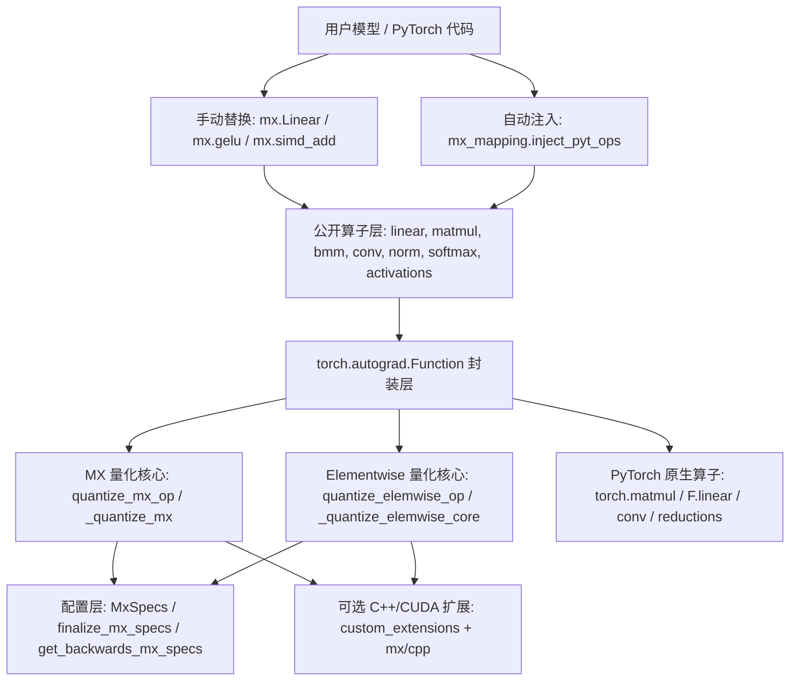

# microxcaling 项目架构分析

本文档基于 GitNexus 索引结果、`README.md`、`pyproject.toml` 以及 `mx/` 下核心源码整理。当前仓库在 GitNexus 中的索引规模为 71 个文件、1,479 个代码节点、2,914 条关系、32 个功能分区和 128 条执行流。

## 1. 项目定位

`microxcaling` 是一个面向 PyTorch 的 MX / bfloat 量化仿真库。它的目标不是提供新的张量执行后端，而是在 PyTorch 的 float32 / bfloat16 / fp16 计算之上，把数值限制到 OCP MX 格式或 bfloat/fp 自定义格式可表示的范围内，从而支持深度学习模型在不同低精度格式下的数值探索。

项目提供两类能力：

- MX 量化矩阵类算子：`linear`、`matmul`、`bmm`、卷积、转置卷积等，重点处理共享指数、block size、权重/激活/反向传播格式。
- elementwise / vector 低精度仿真：激活函数、softmax、norm、SIMD 风格加减乘除、归约、sqrt、exp、log 等，重点通过 bfloat 或 fp 格式对中间结果量化。

## 2. 顶层结构

```text
microxcaling/
├── mx/                         # Python 包主体
│   ├── specs.py                # MX 配置对象、默认值、argparse 接入、配置归一化
│   ├── formats.py              # 格式枚举、舍入枚举、格式参数计算
│   ├── mx_ops.py               # MX 共享指数 / 分块 / 核心 MX 量化
│   ├── elemwise_ops.py         # bfloat/fp/int 风格 elementwise 量化
│   ├── vector_ops.py           # 非 autograd 的向量基础操作
│   ├── simd_ops.py             # 带 autograd 的 SIMD 风格操作
│   ├── linear.py/matmul.py/bmm.py
│   ├── convolution.py/transpose_convolution.py
│   ├── activations.py/softmax.py
│   ├── layernorm.py/groupnorm.py/batchnorm.py/norm_utils.py
│   ├── rnn.py
│   ├── mx_mapping.py           # PyTorch 自动注入映射
│   ├── custom_extensions.py    # 编译并加载 C++/CUDA 扩展
│   ├── cpp/                    # C++/CUDA 自定义量化与归约 kernel
│   └── tests/                  # 单元测试
├── examples/                   # 手动接入与自动注入示例
├── README.md
├── pyproject.toml
└── MX_Integration_Guide.pdf
```

## 3. 架构分层



### 3.1 配置层

核心文件是 `mx/specs.py`。

`MxSpecs` 继承自 `collections.UserDict`，集中定义所有量化选项，包括：

- MX 格式：`scale_bits`、`w_elem_format`、`a_elem_format`、反向传播相关格式、`block_size`、`shared_exp_method`。
- elementwise 格式：`bfloat`、`fp`、`bfloat_subnorms`。
- 训练控制：`quantize_backprop`。
- 舍入控制：全局 `round` 以及 output、weight、grad、MX forward/backward 各路径的细分舍入配置。
- 执行后端：`custom_cuda`。

配置标准化由 `finalize_mx_specs` 完成：它会把未显式设置的反向传播格式继承自前向格式，把多个细分舍入选项继承自全局舍入选项，并通过 `apply_mx_specs` 补齐默认值。如果完全没有开启量化配置，默认会提前返回 `None`，让上层算子直接走 PyTorch 原生路径。

### 3.2 格式与数值工具层

`mx/formats.py` 定义 `RoundingMode`、`ElemFormat` 以及格式参数计算函数。`mx/elemwise_ops.py` 和 `mx/mx_ops.py` 都依赖这里的格式元数据来得到 exponent bits、mantissa bits、最大正规数等信息。

这层的职责是把字符串配置如 `fp8_e5m2`、`fp6_e3m2`、`fp4_e2m1`、`int8` 映射到可执行的数值约束。

### 3.3 MX 量化核心

核心文件是 `mx/mx_ops.py`。

关键函数：

- `_shared_exponents`：按指定轴计算共享指数，常用策略是对绝对值取 max 后 `floor(log2(...))`。
- `_reshape_to_blocks` / `_undo_reshape_to_blocks`：把输入张量按 block size 切成 MX 分块，完成 padding、view 和恢复。
- `_quantize_mx`：执行完整 MX 量化。流程是选择共享指数、处理 block、按 shared exponent 缩放、调用 elementwise core 量化尾数，再缩放回原尺度。
- `quantize_mx_op`：面向上层 autograd 算子的公开入口，负责从 `mx_specs` 取 `scale_bits`、`block_size`、`shared_exp_method`、`custom_cuda` 等配置。

GitNexus 显示 `quantize_mx_op` 是矩阵类算子的中心依赖，被 `linear`、`matmul`、`bmm`、`convolution`、`transpose_convolution` 的 forward 和 backward 路径共同调用。

### 3.4 Elementwise 量化核心

核心文件是 `mx/elemwise_ops.py`。

关键函数：

- `_round_mantissa`：实现 `dither`、`floor`、`nearest`、`even` 等舍入模式。
- `_quantize_elemwise_core`：对输入张量执行 mantissa 截断、denorm 控制、Inf/NaN 处理和范围饱和/溢出。
- `_quantize_bfloat`：把张量限制到 bfloatX 格式。
- `_quantize_fp`：把张量限制到固定 5 exponent bits 的 fpX 格式。
- `quantize_elemwise_op`：上层公开入口，按 `mx_specs["bfloat"]` 或 `mx_specs["fp"]` 选择具体量化方式。

`mx/vector_ops.py` 是基于 `quantize_elemwise_op` 的非 autograd 向量操作层；`mx/simd_ops.py` 则为加减乘除、sqrt、exp、log、sum、mean、norm 等操作提供 autograd 封装。

### 3.5 算子封装层

矩阵类算子通常采用相同模式：

1. 入口函数或 Module 检查 `mx_specs`。
2. 如果 `mx_specs is None`，直接调用 PyTorch 原生算子。
3. 否则通过 `apply_mx_specs` 补齐配置。
4. 使用自定义 `torch.autograd.Function` 控制 forward 和 backward。
5. forward 中先做 elementwise 量化，再做 MX 量化，然后调用 PyTorch 原生计算。
6. backward 中根据 `get_backwards_mx_specs` 决定是否量化反向传播，并对 grad input / grad weight / grad output 使用不同格式和舍入策略。

代表模块：

- `mx/linear.py`：`LinearFunction`、`linear`、`Linear`。前向对 input 和 weight 分别使用 activation/weight MX 格式；反向分别计算 `grad_weight`、`grad_input`、`grad_bias`。
- `mx/matmul.py`：`MatMulFunction`、`matmul`。支持 `mode_config` 为 `aa`、`aw`、`wa`，用于区分 activation/weight 组合。
- `mx/bmm.py`：`BMMFunction`、`bmm`。支持多 outer dims 的 batch matmul。
- `mx/convolution.py`、`mx/transpose_convolution.py`：把卷积权重和输入以类似矩阵乘路径量化。

norm、activation、softmax 等模块更多依赖 `vector_ops` / `simd_ops` / `norm_utils` 的 elementwise 量化路径，用低精度向量操作模拟非矩阵运算。

## 4. 关键执行流

### 4.1 手动集成

`examples/ffn_mx_manual.py` 展示手动替换方式：

```text
argparse
  -> add_mx_args
  -> get_mx_specs
  -> mx.LayerNorm / mx.Linear / mx.gelu / mx.simd_add
  -> 各算子内部执行 elementwise + MX 量化
```

这种方式显式、可控，适合逐层验证量化误差，也更容易针对单个算子配置或调试。

### 4.2 自动注入

`mx/mx_mapping.py` 提供 `inject_pyt_ops(mx_specs)`：

- `FUNCTION_MAPPING` 把 `torch` 和 `torch.nn.functional` 中的 `linear`、`gelu`、`softmax`、`matmul`、`bmm`、`add`、`mul`、`sum` 等替换成 MX 版本。
- `MODULE_MAPPING` 把 `torch.nn.Linear`、`LayerNorm`、`Conv2d`、`LSTM` 等替换成 MX 子类工厂。
- `tracer_decorator` 会保留原调用签名中的 `dtype` 处理，并把固定的 `mx_specs` 注入到 MX 函数。

`examples/ffn_mx_auto.py` 展示了在构建模型前调用 `mx_mapping.inject_pyt_ops(mx_specs)`，随后普通 PyTorch 模型会被替换为 MX 版本。

### 4.3 Linear forward 路径

```text
mx.linear / mx.Linear.forward
  -> LinearFunction.forward
  -> quantize_elemwise_op(input, round_output)
  -> quantize_elemwise_op(weight, round_weight)
  -> quantize_mx_op(input, a_elem_format, axes=[-1])
  -> quantize_mx_op(weight, w_elem_format, axes=[-1])
  -> F.linear(...)
  -> quantize_elemwise_op(output, round_output)
  -> optional bias add + output quantize
```

这个路径体现了项目的核心思路：矩阵乘的参与者先做 elementwise 量化，再按 MX 共享指数格式量化，真正的乘加仍交给 PyTorch。

### 4.4 Linear backward 路径

```text
LinearFunction.backward
  -> quantize_elemwise_op(grad_output, round_grad_input)
  -> quantize_mx_op(input, a_elem_format_bp, axes=[-2])
  -> quantize_mx_op(grad_output, a_elem_format_bp_ex, axes=[-2])
  -> torch.matmul(...) 得到 grad_weight
  -> quantize_elemwise_op(grad_weight, round_grad_weight)
  -> quantize_mx_op(weight, w_elem_format_bp, axes=[0])
  -> quantize_mx_op(grad_output, a_elem_format_bp_os, axes=[-1])
  -> torch.matmul(...) 得到 grad_input
  -> quantize_elemwise_op(grad_input, round_grad_input)
```

如果 `quantize_backprop` 为 `False`，`get_backwards_mx_specs` 会把反向传播相关 MX / bfloat / fp 配置清空，使反向路径退回不量化。

## 5. C++ / CUDA 扩展

`mx/custom_extensions.py` 使用 `torch.utils.cpp_extension.load` 编译并加载以下源文件：

- `mx/cpp/funcs.cpp`
- `mx/cpp/mx.cu`
- `mx/cpp/elemwise.cu`
- `mx/cpp/reduce.cu`

`funcs.cpp` 通过 pybind 暴露：

- `quantize_mx_func_cpp`
- `quantize_elemwise_func_cpp`
- `quantize_mx_func_cuda`
- `quantize_mx_by_tile_func_cuda`
- `quantize_elemwise_func_cuda`
- `reduce_sum_inner_dim`
- `reduce_max_inner_dim`

Python 侧在 `mx_specs["custom_cuda"]` 为真且设备/舍入模式满足条件时，会优先调用这些扩展。README 中也说明 custom CUDA 在 MX 数值准确性和速度上优于某些 PyTorch GPU 路径。

## 6. 测试体系

测试集中在 `mx/tests/`，覆盖：

- 核心格式与量化：`test_formats.py`、`test_quantize_mx.py`、`test_quantize_elemwise.py`、`test_mxfp_none.py`、`test_e5m0_scale.py`。
- 矩阵/卷积算子：`test_linear.py`、`test_matmul.py`、`test_bmm.py`、`test_conv.py`。
- 非矩阵算子：`test_activations.py`、`test_softmax.py`、`test_layernorm.py`、`test_groupnorm.py`、`test_batchnorm.py`、`test_adaptive_avg_pooling.py`、`test_simd.py`。
- 梯度与边界：`test_gradcheck.py`、`test_corners_mx.py`、`test_corners_elemwise.py`。

测试基本按算子类型组织，适合在修改某个模块后运行对应文件进行局部回归。

## 7. 主要依赖和构建方式

`pyproject.toml` 声明包名为 `mx`，Python 版本要求为 `>=3.8`，核心依赖固定为：

- `torch==2.2.0`
- `torchvision==0.16`
- `torchaudio==2.1.0`

构建后端使用 `hatchling` 和 `hatch-vcs`，wheel/sdist 只包含 `/mx`。当前 `build.py` 自定义 hook 在 `pyproject.toml` 中被注释，因此 C++/CUDA 扩展不是安装期预编译，而是在 `custom_extensions.py` 被导入时通过 PyTorch extension JIT 编译。

## 8. 架构特点

- 配置驱动明显：`MxSpecs` 是全库行为的中心，几乎所有公开算子都接收 `mx_specs`。
- 原生 PyTorch 兼容性强：未开启量化时大多数入口直接退回 PyTorch 原生实现。
- 算子实现模式统一：公开函数 / Module -> autograd Function -> quantize_elemwise_op / quantize_mx_op -> PyTorch 原生算子。
- 前向和反向格式分离：权重、激活、反向权重、反向激活、梯度输出可以配置不同 MX 格式。
- 性能路径可选：默认纯 PyTorch 实现便于可移植和调试，`custom_cuda` 打开后走 C++/CUDA kernel。
- 自动注入提供低侵入集成：适合快速把已有 PyTorch 模型替换成 MX 仿真路径，但会修改全局 `torch` / `torch.nn` 命名空间，需要谨慎控制调用时机。

## 9. 潜在风险与维护关注点

- `custom_extensions.py` 在导入时立即 JIT 编译扩展，首次使用成本较高，并且依赖本机 CUDA / compiler 环境。
- `mx_mapping.inject_pyt_ops` 会全局改写 PyTorch 命名空间，适合实验脚本，不太适合长期运行进程中的局部启停。
- 部分模块同时支持训练和推理，反向传播量化配置较细，修改 `MxSpecs` 默认值或字段名时影响面很广。
- `quantize_elemwise_op` 和 `quantize_mx_op` 是全库高复用核心，任何数值行为变化都会影响大量算子和测试。
- `pyproject.toml` 中 PyTorch 依赖版本固定，和 README 中提到的测试环境版本存在差异，环境升级时应优先跑完整测试。

## 10. 阅读和修改建议

如果要理解或修改项目，建议按以下顺序：

1. 先读 `mx/specs.py`，确认量化配置含义和默认值继承规则。
2. 再读 `mx/elemwise_ops.py` 和 `mx/mx_ops.py`，理解两条核心量化路径。
3. 选择一个代表算子读完整前反向，例如 `mx/linear.py`。
4. 再扩展到 `matmul`、`bmm`、`convolution`、norm、activation 等模块。
5. 如果涉及性能或数值误差，再读 `mx/cpp/funcs.cpp`、`mx/cpp/mx.cu`、`mx/cpp/elemwise.cu`。
6. 修改后按影响范围运行对应测试，核心量化逻辑变更应覆盖矩阵、elementwise、gradcheck 和 corner case 测试。

